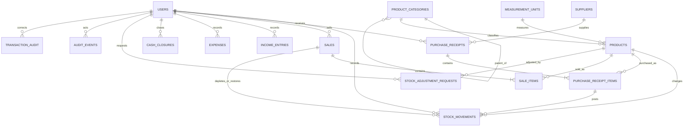

# Essuman's Cold Store Data Model

This is the shared relational design for the four delivery phases now defined. The current implementation is a single business, single register deployment; the schema includes a business profile for currency, timezone, fiscal-year reporting, and receipt branding. Reports are queries/views over operational facts, not copied summary tables.

## Relationships



## Tables By Phase

| Phase | Tables | Purpose |
|---|---|---|
| 1: Foundation & Inventory | `business_profile`, `users`, `product_categories`, `measurement_units`, `products`, `suppliers`, `purchase_receipts`, `purchase_receipt_items`, `stock_movements`, `stock_adjustment_requests` | Authentication/roles; normalized product dimensions; supplier receipts; current stock with an immutable movement trail; reviewed adjustments. |
| 2: Daily Operations | `sales`, `sale_items`, `income_entries`, `expenses`, `cash_closures` | Tendered sales, item-level price/cost snapshots, other income, operating expenses, attendant day close and cash variance. |
| 3: Management & Reporting | `audit_events`, `transaction_audit`, `report_*` views | Append-only business activity trail; before/after correction trail; report and analytics projections derived from operational facts. |
| 4: Receipt & Printing | `sales` receipt/payment snapshots, `sale_items` discount/line snapshots, `business_profile` receipt branding | Dedicated searchable/reprintable receipt is a rendered view of the persisted sale and business-profile fields; no duplicate receipt ledger is needed. |

## Important Grain And Rules

- `products.current_stock` is the fast operational balance. Every receipt, sale, reversal, and approved adjustment also creates a `stock_movements` row in the same database transaction. The movement ledger is the audit/reconciliation source.
- A `purchase_receipts` row is a delivery header; `purchase_receipt_items` holds product, unit, quantity, received unit cost, and extended cost. Supplier identity is normalized in `suppliers`. The current receiving API creates/reuses a supplier by normalized name and writes a one-line receipt; the schema supports multi-line deliveries.
- Product `cost_price` is the moving weighted-average cost. On receipt: `(old stock × old average cost + received quantity × received unit cost) / new stock`. Each `sale_items.unit_cost_price` snapshots this value when sold, so historical COGS does not change when later purchase costs change.
- `sale_items.unit_selling_price`, `unit_cost_price`, `line_total`, and `line_profit` are immutable historical values. P&L COGS is the sum of completed sale-line quantity × snapshotted cost; gross profit is sales less that COGS. A reversed sale remains in history but is excluded from sales, COGS, and profit reports. Its stock is restored through compensating movements.
- A receipt is a print/PDF presentation of one immutable sale snapshot, not a second transaction entity. Its unique `sales.receipt_number` joins line snapshots and the business profile. This avoids two independently editable copies of the same sale.
- Receipt fields `receipt_number`, `subtotal`, `discount_amount`, `total_amount`, `amount_paid`, `change_due`, `payment_method`, attendant, timestamp, line quantities/prices, and the configured business identity are captured for reprint. Discounts are proportionally allocated to sale lines and line profit is computed from discounted line total less snapshotted COGS. The receipt is not regenerated from current product prices.
- `income_entries` and `expenses` have their own tender type because expected drawer cash only includes cash movements. Voids retain the original row and are excluded from financial reports. Corrections retain a before/after record in `transaction_audit` and `audit_events`.
- `cash_closures` is a per-attendant, per-business-date snapshot protected by a unique constraint. Expected cash is cash sales + cash income − cash expenses; difference is actual cash − expected cash. Sale and finance writes serialize with closeout for that attendant/day.
- `audit_events` is the human-readable append-only-by-application timeline. It stores actor name/role snapshots so historical entries remain interpretable if a user is later renamed or deactivated. Production database roles should grant the application INSERT/SELECT but not UPDATE/DELETE on audit tables. `transaction_audit` remains the focused before/after finance correction log for compatibility.
- `business_profile.time_zone` defines the reporting calendar day. Store all event instants as `TIMESTAMPTZ`; convert to the configured business timezone for daily, weekly, monthly, quarterly, and annual periods. `fiscal_year_start_month` defines fiscal quarters/year when the business does not use a calendar fiscal year.
- `products.category` and `products.unit` are compatibility labels while the existing API transitions to normalized `category_id` and `unit_id`; create/edit writes both together. The foreign keys are the normalized source of truth.

## Profit & Loss Formula

For a selected half-open date range `[start, end)` in business-local time:

```text
Net sales             = completed sale line totals
Cost of goods sold    = completed sale line quantity × snapshotted unit cost
Gross profit          = net sales − cost of goods sold
Other income          = non-void income entries
Operating expenses    = non-void expense entries
Net profit            = gross profit + other income − operating expenses
```

Purchase receipts are a purchasing/cash-flow report, not a direct P&L expense when received; their cost is recognized in P&L as units are sold. Remaining stock valuation is current stock × weighted-average unit cost. Reports should use indexed timestamp range predicates and grouped queries against the facts/views, not scan client data.

## Report Sources

- Sales and payment mix: `report_sale_lines`, `sales`, `sale_items`.
- Purchase/supplier report: `report_purchase_lines`.
- Stock, low-stock and valuation: `report_stock_valuation`, `stock_movements`.
- Expense and other-income trends: `report_expenses_by_day`, `report_income_by_day`.
- P&L: completed sales/line snapshots plus non-void `income_entries` and `expenses`.
- Attendant sales: `report_attendant_sales`.
- Daily cash and discrepancies: `cash_closures` plus underlying sale/income/expense facts.
- Product performance: `report_product_performance`; slow moving means active product with no sale within the selected interval, or the oldest `last_sold_at`.
- Audit: `audit_events`, with `transaction_audit` for detailed finance correction history.

PDF, Excel and CSV are export formats generated from the same authorized report query; no report-specific persistence tables are needed. Custom ranges should validate `start < end`, use inclusive start/exclusive end, and use the configured business timezone.

## Scope Assumptions

Phase labels remain exactly Phase 1, Phase 2, Phase 3, and Phase 4. This initial schema assumes one legal business and one cash register. If multiple branches/registers or split tender are confirmed before production, add `stores`, `registers`, `cash_sessions`, and a `sale_payments` child table before enabling those workflows; avoid encoding those concepts as free-text fields.
